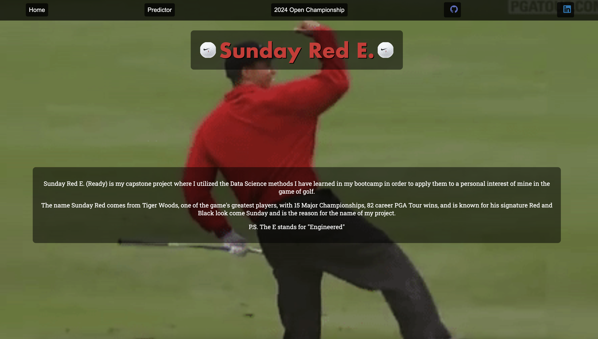

# Sunday Red E. (Engineered)
Welcome to my Capstone Project!

## Project Overview
**Project Title:** Sunday Red E. (Engineered)

**Purpose:**  
The purpose of this project is to track performances of golfers competing in PGA's 4 Majors (and The Players) and predict the Sunday leaderboard and thus, the winners of each tournament. This project aims to investigate the volatility in golf performance and predict player outcomes based on historical data. The primary beneficiaries of this project include bettors, staff, commentators, and writers who can use the data to craft narratives and understand outcomes better.

**Machine Learning Integration:**  
The project incorporates machine learning by analyzing past performance data, tee times, and overall performance to predict future tournament outcomes.

## Data Fields
The data for this project is sourced from [datagolf](https://datagolf.com/). Below is a summary of the key data fields:

| Field                   | Description                                                                                       |
|-------------------------|---------------------------------------------------------------------------------------------------|
| `year`                  | Year in which the tournament was played                                                           |
| `season`                | Season of which the tournament was played                                                         |
| `event_id`              | ID for the tournament (1-PLAYERS, 2-Masters, 3-PGA, 4-U.S. Open, 5-The Open)                     |
| `dg_id`                 | ID for the player                                                                                 |
| `fin_text`              | Finishing position                                                                                |
| `round_num`             | Round number                                                                                      |
| `course_num`            | Course number                                                                                     |
| `course_par`            | Par for the respective course                                                                     |
| `round score`           | Score for the round                                                                               |
| `sg_putt`               | Strokes gained putting                                                                            |
| `sg_arg`                | Strokes gained around the green                                                                   |
| `sg_app`                | Strokes gained approach the green                                                                 |
| `sg_ott`                | Strokes gained off-the-tee                                                                        |
| `sg_t2g`                | Strokes gained tee-to-green (sg_arg + sg_app + sg_ott)                                            |
| `sg_total`              | Strokes gained total (sg_putt + sg_arg + sg_app + sg_ott)                                         |
| `driving_dist`          | Average distance of drives on par 4 and 5s                                                        |
| `driving_acc`           | Percentage of fairways hit                                                                        |
| `gir`                   | Percentage of greens hit in regulation (including fringes)                                        |
| `scrambling`            | Percentage of shots hit around the green from 50 yards and in that saved par (or were finished in 2 strokes or less) |
| `prox_rgh`              | Average proximity of all shots hit from locations besides fairway and intermediate rough          |
| `prox_fw`               | Average proximity of all shots hit from the fairway                                               |
| `great_shots`           | Shots in the 95th percentile of strokes gained metrics                                            |
| `poor_shots`            | Shots in the 5th percentile of strokes gained metrics                                             |
| `teetime_int`           | Number of minutes after midnight (e.g., 8:00 AM tee time is 480 minutes after midnight)           |
| `tee_time_of_day_int`   | Grouping of `teetime_int` (1: 8:00 AM - 10:00 AM, 2: 10:00 AM - 12:00 PM, 3: after 12:00 PM)      |
| `made_cut`              | Binary indicator of whether a player made the cut (1) or not (0)                                  |

## Notes about Data
- If a player did not make the cut (`made_cut` = 0), they will not have entries for `round_num` 3 or 4 and no subsequent stats for those rounds.
- `driving_dist` only includes drives on par 4s and par 5s since a driver is not used on par 3s.
- For The Open 2017, Masters 2017, and The PLAYERS 2020, certain metrics are missing, such as broken down strokes gained and average driving distance.
- There is no prediction for The Masters 2020 (cut short due to COVID-19), The Open Championship 2020 (canceled due to COVID-19), and The Open Championship 2024 (event not yet occurred).

## Model Performance
**Prediction Model:** Multiple Linear Regression  
- **Test Set R-squared:** 0.74  
- **Training Set R-squared:** 0.757  
- **Average Prediction Rate:** 57.78%  
- **Median Prediction Rate:** 60%

Through my model, I was able to build a predictor that was able to predict the top-5 finishers in past Majors (+The Players) from 2017-2024 (minus the exclusions noted above). There are even instances where the model was able to predict the 1st-3rd place finishers and as a result, I believe that while there is a lot of volatility in golf, and some that could even not be captured by present metrics, there is a feasible way to make a solid, data-backed recommendation when it comes to prediction on future event(s).

## Project Preview

## To-Do List
- [ ] Explore potential for adjusting model to factor in player performance in other non-Major tournaments
- [ ] Continue to iterate model to adjust for low score predictions in efforts to build forecasting/prediction model for future event(s)
- [ ] Explore possibility for introducing different models
